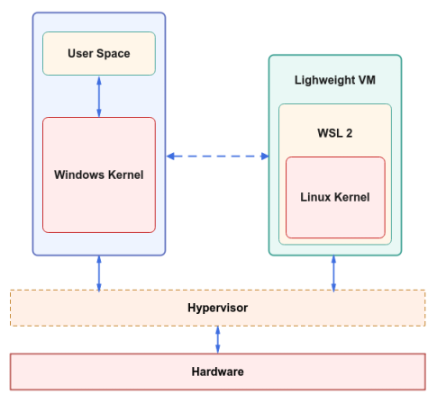

## Установка и настройка WSL

Windows Subsystem for Linux (WSL) — слой совместимости для запуска Linux-приложений (двоичных исполняемых файлов в формате ELF) в ОС Windows 10 и 11.

### Установка

- `Win + R`, ввести `cmd`
- `wsl --install -d Ubuntu` - установить Ubuntu
- `wsl --list --verbose` - проверить что установили (проверить наличие VERSION 2, имеет своё ядро Linux)
- `wsl -d Ubuntu` - запустить Ubuntu из командной строки, также можно открыть через приложение "Ubuntu"

!!! tip "Если что-то не работает, то перезагрузить ПК"

### Настройка

- `sudo apt update && sudo apt upgrade -y` - обновить пакеты в репозиториях
- `Установить нужные пакеты`
```bash 
sudo apt install -y net-tools git zip unzip curl wget htop fzf gcc build-essential libc6-dev g++-13
```
- `Установить Python`
```bash
sudo apt install -y python3 python3-pip
# проверка установки
python3 --version
pip3 --version
```
- `Установить русские локали`
```bash
locale-gen ru_RU
locale-gen ru_RU.UTF-8
update-locale
```

### Взаимодействие Windows c WSL (рассматриваем WSL Version 2)

WSL работает на основе реального ядра Linux, запущенного внутри виртуальной машины с Hyper-V, WSL совместима почти со всеми Linux-приложениями.



В WSL доступ в интернет осуществляется через виртуальный сетевой интерфейс (программный компонент, который эмулирует работу физического сетевого адаптера), который подключён к внутренней сети, созданной Windows. WSL имеет собственный IP-адрес внутри этой виртуальной сети, но интернет-трафик маршрутизируется через NAT, используя IP-адрес Windows. По сути, WSL выходит в интернет через Windows, а не напрямую. Windows - шлюз для трафика WSL.

У WSL Собственная файловая система (ext4). Доступ к Windows осуществляется через /mnt/c/ (c - буква диска)

!!! info ""
    `Сетевой адаптер` - это аппаратное устройство, которое обеспечивает физическую или виртуальную возможность подключения к сети. 
    
    `Сетевой интерфейс` - это конфигурация, которая управляет работой сетевого адаптера в операционной системе, работает с адаптером для организации передачи данных, отвечает за работу с протоколами, назначение IP-адресов, маршрутизацию.